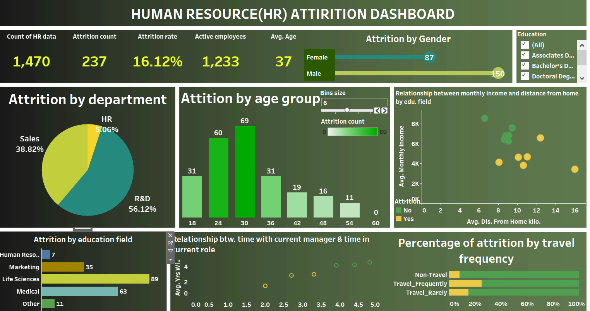

# ACE-TECH-SOLUTIONS-HR-ATTRITION-ANALYSIS

## DISCLAIMER:
All dataset and reports do not represent any company,institution or country but just a dummy dataset to demostrate capabilities of tableau

## INTRODUCTION:

This report presents an in-depth analysis of HR attrition at Ace Tech Solutions. As a data analyst, I have used Tableau to develop an interactive dashboard that aids the HR department in understanding the factors contributing to attrition, tracking attrition KPIs, and fostering a more engaged and stable workforce. The study also explores the relationship between education fields and attrition to devise effective employee retention strategies.

## PROBLEM STATEMENT:
AceTech Solutions is grappling with a rising rate of employee attrition. The HR department needs to analyze the HR Attrition dataset to identify the factors contributing to attrition to track essential attrition KPIs, helping the company develop effective strategies for employee retention and fostera more engaged and stable workforce.

## SKILLS AND CONCEPTS DEMOSTRATED:

Data Connection and Preparation

Drag-and-Drop Interface

Dimensions and Measures

Calculated Fields

Visualizations

Filters

Aggregations

Parameters

Dashboards

Trend Lines

Storytelling

Publishing and Sharing

## ANALYSIS:

  ## VISUAUALISATION:
  

  

     
- count of hr data 1470
  
- attrition count 237
     
- attrition rate 16.12%
  
- active employees
  
- avg. age 37
  
- Attrition by gender:
     -female:87
     -male:150
    
- Attrition by department
     -sales:38.82%
     -hr:5.06%
     -R&D:56.12%   and so on

   ## INSIGHTS:
- The age group with high attirtion rate is 30-35
- The education field with high attrition rate is life scicenes with 89 count
- The high attrition in the travel frequency analysis shows that those that travels frequently had the highest attrition rate  and so on

  ## RECOMMENDATIONS:

1 Departmental Analysis:

   -Identify departments with the highest attrition rates and conduct exit interviews to understand the reasons behind the departures.
   
   -Address any systemic issues within these departments, such as poor management practices, lack of growth opportunities, or excessive workload.
   
   -Implement targeted retention programs and career development plans to increase employee satisfaction and engagement.
   
2 Age Group Insights:

  -Analyze attrition rates across different age groups to identify trends and potential challenges faced by each group.
  
  -Tailor benefits and work-life balance initiatives to meet the unique needs of employees in various age brackets.
  
  -Encourage intergenerational collaboration to foster a sense of inclusivity and mutual learning.
  
3 Travel Frequency Considerations:
   -Assess the impact of frequent travel on attrition rates and employee burnout.
   -Offer flexible work arrangements or virtual meeting options to mitigate the stress associated with frequent travel.
    -Provide support and resources to traveling employees to ensure their well-being and job satisfaction.
    
4 Education Background Insights:

   -Understand the relationship between education background and attrition rates.
   
  -Create opportunities for continuous learning and skill development to cater to the needs of employees with diverse educational backgrounds.
    
   -Encourage a culture of intellectual growth and career advancement.
   
5 Time with Current Employer:

  -Analyze attrition rates based on the length of time an employee has been with the organization.
  
  -Recognize and reward long-tenured employees to increase their sense of loyalty and commitment.
  
   -Implement mentorship programs to support the integration of new hires and reduce early attrition.
   
6 Gender-Based Analysis:

   -Investigate any gender-related factors contributing to attrition, such as pay disparity or biased promotion practices.
   
   -Ensure equal opportunities for career growth and advancement for all genders.
   
   -Implement diversity and inclusion initiatives to foster a supportive and equitable work environment.
   
7 Employee Engagement Initiatives:

   -Conduct regular engagement surveys to gauge employee satisfaction and identify pain points.
   
   -Act on feedback received and address concerns promptly to enhance employee morale.
   
   -Foster a positive work culture that promotes teamwork, recognition, and open communication.
   
8 Training and Development:

   -Invest in robust training and development programs to upskill employees and enhance their job satisfaction.
   
   -Offer growth opportunities aligned with individual career aspirations.
   
   -Link performance reviews with learning and development outcomes.
   
9 Transparent Performance Appraisals:

   -Ensure performance appraisals are fair, transparent, and based on objective criteria.
   
  -Provide constructive feedback to help employees grow and improve.
  
  -Recognize and reward exceptional performance to boost employee motivation.
  
10 Employee Support and Wellness:

   -Offer comprehensive employee support programs, including mental health resources and work-life balance initiatives.
   
   -Promote employee well-being to reduce stress and burnout.
   
By adopting a data-driven approach and implementing a combination of strategies, organizations can address high attrition rates effectively and create a workplace that attracts and retains top talent. Regularly monitoring and evaluating the success of these initiatives will help fine-tune the approach over time.

  

  

  
