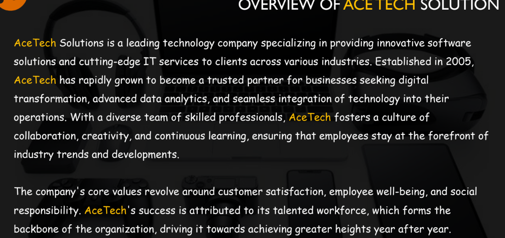
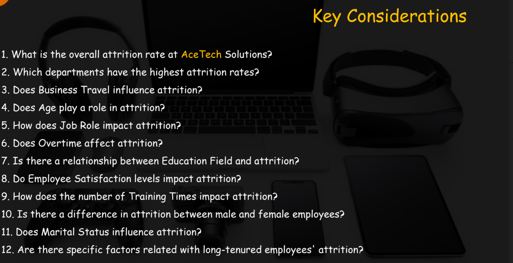

# ACE-TECH-SOLUTIONS-HR-ATTRITION-ANALYSIS

## DISCLAIMER:
All dataset and reports do not represent any company,institution or country but just a dummy dataset to demostrate capabilities of tableau

## INTRODUCTION:

This report presents an in-depth analysis of HR attrition at Ace Tech Solutions. As a data analyst, I have used Tableau to develop an interactive dashboard that aids the HR department in understanding the factors contributing to attrition, tracking attrition KPIs, and fostering a more engaged and stable workforce. The study also explores the relationship between education fields and attrition to devise effective employee retention strategies.

## PROBLEM STATEMENT:
AceTech Solutions is grappling with a rising rate of employee attrition. The HR department needs to analyze the HR Attrition dataset to identify the factors contributing to attrition to track essential attrition KPIs, helping the company develop effective strategies for employee retention and fostera more engaged and stable workforce.

## SKILLS AND CONCEPTS DEMOSTRATED:

Data Connection and Preparation

Drag-and-Drop Interface

Dimensions and Measures

Calculated Fields

Visualizations

Filters

Aggregations

Parameters

Dashboards

Trend Lines

Storytelling

Publishing and Sharing

## ANALYSIS:

  ## VISUAUALISATION:

  
